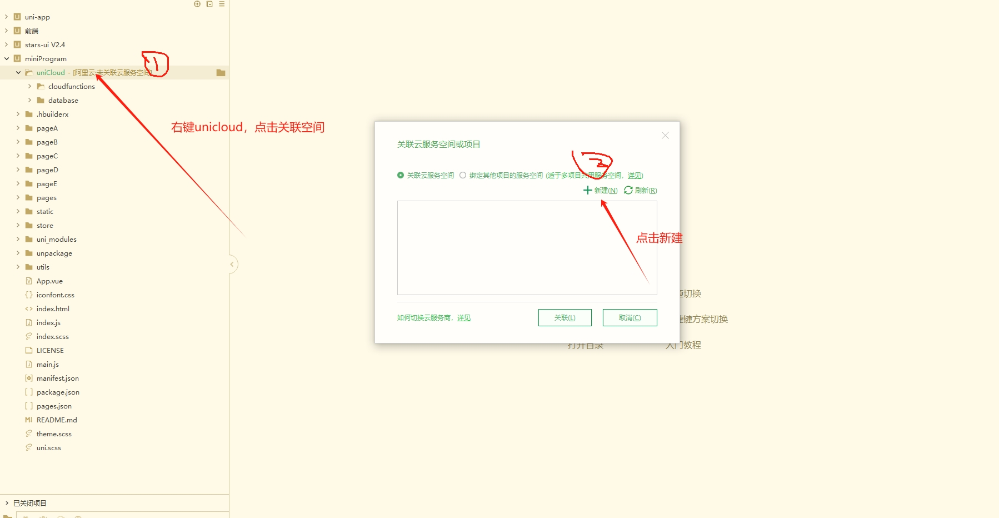

1.项目介绍

测试环境：HbuilderX，阿里云uniCloud, 微信开发工具

技术栈： uniapp，serverless，Node.js，uniCloud，云函数，云数据库，uni-admin

项目结构：miniProgram（uniapp小程序），zcy-admin（uni-admin后端管理web），dbData（数据库数据，schema都在项目文件中）

功能更模块：

2.项目部署

项目经过本人本地测试，确保可以运行，请不要怀疑项目不完整

打开HbuilderX工具，导入miniProgram，然后参考下面几个图，创建阿里云服务空间，并关联

关联后，右键uniCloud和database目录，按照下图操作
通过HbuilderX导入zcy-admin项目，按照上面的步骤操作，上传到云服务空间
分别运行，miniProject运行到微信小程序，zcy-admin运行到浏览器

右键项目，打开云空间管理web，点击云数据库，将“数据库数据”文件里的data.json导入到对应的数据库

注册一个超级管理员，然后登录

3.项目部分截图  

   

# 4.获取方式
[戳我查看](https://gitee.com/aven999/mall)      
